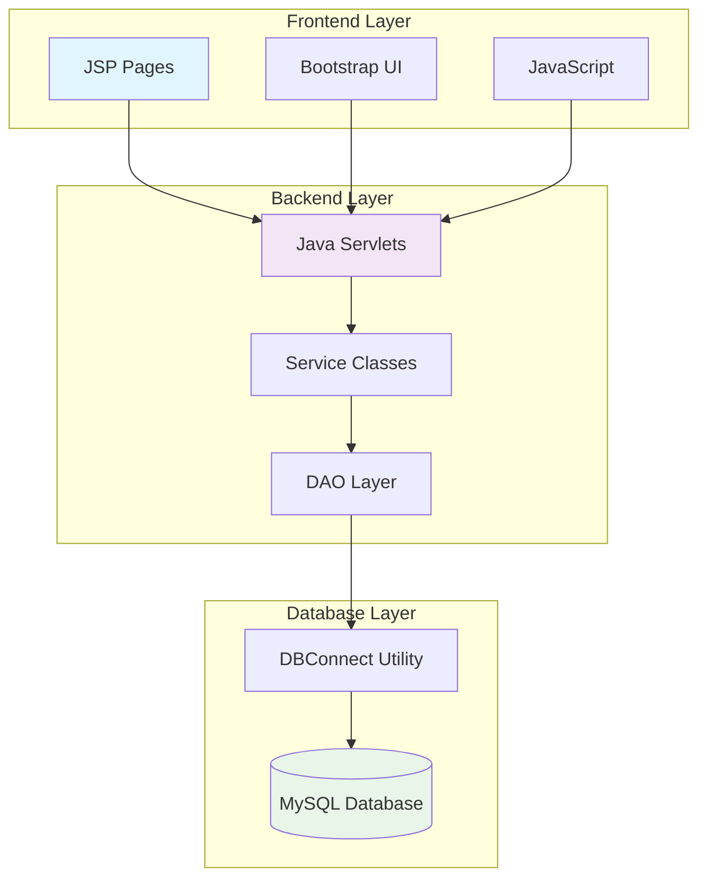

# 🚗 Imex Car Sale System

<div align="center">


**A comprehensive Java-based vehicle marketplace with advanced admin management**

[🚀 Demo](#-screenshots) • [📖 Documentation](#-installation) • [🛠️ Setup](#️-installation) • [🤝 Contributing](#-contributing)

</div>

## 📋 Project Overview

Imex Car Sale is a **full-stack vehicle marketplace platform** built with Java JSP/Servlet architecture, featuring robust admin controls, secure user authentication, and comprehensive vehicle management capabilities.

### 🎯 **Key Highlights**
- 🔐 **Secure Authentication** - SHA-256 password hashing with session management
- 👨‍💼 **Admin Dashboard** - Complete CRUD operations for brands, categories & vehicles
- 🖼️ **Image Management** - Multi-image upload with file validation
- 🔍 **Advanced Search** - Multi-filter search functionality
- 📧 **Inquiry System** - Customer communication management
- 🛡️ **SQL Injection Protection** - Prepared statements & input validation

---

## 🏗️ System Architecture



---

## ✨ Feature Matrix

<table>
<tr>
<td width="50%">

### 🧩 **Core Modules**
| Module | Functionality |
|--------|---------------|
| 🏷️ **Brand Management** | CRUD operations with referential integrity |
| 📂 **Category System** | Hierarchical categorization & validation |
| 🚙 **Vehicle Management** | Full lifecycle management + multi-image support |
| 👤 **User Authentication** | Secure login with session handling |
| 📞 **Inquiry System** | Customer communication & lead management |

</td>
<td width="50%">

### 🔒 **Security Features**
- ✅ SHA-256 Password Encryption
- ✅ Session-based Authentication
- ✅ SQL Injection Prevention
- ✅ CSRF Protection
- ✅ Input Validation & Sanitization
- ✅ File Upload Security
- ✅ Role-based Access Control

</td>
</tr>
</table>

---

## 🖥️ Screenshots

<div align="center">

### Admin Dashboard


### Vehicle Management


### Brand Management


### Categories Management


### User Experience


</div>

---

## ⚙️ Installation & Setup

### 📋 **Prerequisites**
```bash
☑️ Java 8+ (JDK)
☑️ Apache Tomcat 9+
☑️ MySQL 8.0+
☑️ Eclipse IDE / IntelliJ IDEA
☑️ Maven (optional)
```

### 🚀 **Quick Start**

<details>
<summary><b>📥 Step 1: Clone Repository</b></summary>

```bash
git clone https://github.com/yourusername/imex-car-sale.git
cd imex-car-sale
```
</details>

<details>
<summary><b>🗄️ Step 2: Database Setup</b></summary>

```sql
-- Create database
CREATE DATABASE imex_car_sale;
USE imex_car_sale;

-- Import provided SQL schema
SOURCE database/schema.sql;

-- Insert sample data (optional)
SOURCE database/sample_data.sql;
```
</details>

<details>
<summary><b>⚙️ Step 3: Configuration</b></summary>

Update database credentials in `src/config/DBConnect.java`:
```java
private static final String URL = "jdbc:mysql://localhost:3306/imex_car_sale";
private static final String USERNAME = "your_username";
private static final String PASSWORD = "your_password";
```
</details>

<details>
<summary><b>🚀 Step 4: Deploy & Run</b></summary>

1. Import project into your IDE
2. Configure Tomcat server
3. Deploy the application
4. Access: `http://localhost:8080/imex-car-sale`
</details>

---

## 🗃️ Database Schema

<details>
<summary><b>📊 Complete Database Structure</b></summary>

### **Core Tables**

```sql
-- Vehicle Management (Main Entity)
CREATE TABLE vehicle (
    vehicleId INT PRIMARY KEY AUTO_INCREMENT,
    title VARCHAR(100),
    price DOUBLE,
    manufactureYear YEAR,
    model VARCHAR(50),
    modelVariant VARCHAR(50),
    mileage VARCHAR(50),
    engineCapacity VARCHAR(45),
    description TEXT,
    categoryId INT NOT NULL,
    brandId INT NOT NULL,
    fuelTypeId INT NOT NULL,
    transmissionId INT NOT NULL,
    featuringId INT NOT NULL,
    userId INT NOT NULL,
    locationId INT NOT NULL,
    conditionId INT NOT NULL
);

-- Vehicle Images
CREATE TABLE vehimgpaths (
    vehimgpathsId INT PRIMARY KEY AUTO_INCREMENT,
    vehimgpath TEXT,
    vehicleId INT NOT NULL,
    FOREIGN KEY (vehicleId) REFERENCES vehicle(vehicleId) ON DELETE CASCADE
);

-- User Management
CREATE TABLE users (
    userId INT PRIMARY KEY AUTO_INCREMENT,
    name VARCHAR(100),
    email VARCHAR(100),
    password TEXT -- SHA-256 hashed passwords
);

-- Customer Inquiries
CREATE TABLE inquires (
    inquiryId INT PRIMARY KEY AUTO_INCREMENT,
    customerName VARCHAR(50),
    customerEmail VARCHAR(100),
    customerMobile VARCHAR(10),
    inquiry TEXT,
    vehicleId INT NOT NULL,
    FOREIGN KEY (vehicleId) REFERENCES vehicle(vehicleId) ON DELETE CASCADE
);
```

### **Reference/Lookup Tables**

```sql
-- Vehicle Categorization
CREATE TABLE brand (
    brandId INT PRIMARY KEY AUTO_INCREMENT,
    brand VARCHAR(45)
);

CREATE TABLE category (
    categoryId INT PRIMARY KEY AUTO_INCREMENT,
    category VARCHAR(45)
);

-- Vehicle Specifications
CREATE TABLE fueltype (
    fuelTypeId INT PRIMARY KEY AUTO_INCREMENT,
    fuelType VARCHAR(45)
);

CREATE TABLE transmission (
    transmissionId INT PRIMARY KEY AUTO_INCREMENT,
    transmission VARCHAR(45)
);

CREATE TABLE conditions (
    conditionId INT PRIMARY KEY AUTO_INCREMENT,
    condition VARCHAR(45)
);

-- Additional Attributes
CREATE TABLE location (
    locationId INT PRIMARY KEY AUTO_INCREMENT,
    location VARCHAR(45)
);

CREATE TABLE featuring (
    featuringId INT PRIMARY KEY AUTO_INCREMENT,
    featuring VARCHAR(45) -- 'Recommended' or 'Normal'
);
```

### **Database Relationships**
```
vehicle (1) ←→ (M) vehimgpaths
vehicle (M) ←→ (1) brand
vehicle (M) ←→ (1) category
vehicle (M) ←→ (1) fueltype
vehicle (M) ←→ (1) transmission
vehicle (M) ←→ (1) conditions
vehicle (M) ←→ (1) location
vehicle (M) ←→ (1) featuring
vehicle (M) ←→ (1) users
vehicle (1) ←→ (M) inquires
```

### **Sample Data Overview**
| Table | Records | Examples |
|-------|---------|----------|
| **Brands** | 12 | Toyota, Honda, BMW, Tesla, Mercedes-Benz |
| **Categories** | 20 | SUV, Sedan, Truck, Electric, Convertible |
| **Fuel Types** | 11 | Petrol, Diesel, Electric, Hybrid, CNG |
| **Transmissions** | 11 | Manual, Automatic, CVT, Semi-Automatic |
| **Locations** | 41 | Colombo districts, major Sri Lankan cities |
| **Conditions** | 5 | Brand New (Registered/Unregistered), Used |

</details>

---

## 🌟 Roadmap & Development Status

### ✅ **Completed Features**
- [x] 🔐 User Authentication & Authorization
- [x] 🚗 Vehicle CRUD Operations
- [x] 🖼️ Multi-image Upload System
- [x] 🔍 Advanced Search & Filtering
- [x] 📊 Admin Dashboard
- [x] 📞 Customer Inquiry Management

### 🚧 **In Development**
- [ ] ⚡ Electric Vehicle Specialty Section
- [ ] 📱 Mobile Responsive Design
- [ ] 📈 Advanced Analytics Dashboard

### 🎯 **Future Enhancements**
- [ ] 🤖 AI-powered Vehicle Recommendations
- [ ] 🗺️ Location-based Search
- [ ] 📊 Market Price Analysis
- [ ] 🔄 Vehicle Comparison Tool

---

## 🛠️ Tech Stack

<div align="center">

| **Frontend** | **Backend** | **Database** | **Tools** |
|:------------:|:-----------:|:------------:|:---------:|
|  |  |  |  |
|  |  |  |  |
|  |  | |  |

</div>

---

## 📖 API Documentation

<details>
<summary><b>🔗 Servlet Endpoints</b></summary>

| Endpoint | Method | Description |
|----------|--------|-------------|
| `/login` | POST | User authentication |
| `/vehicles` | GET | Retrieve vehicle listings |
| `/vehicles/add` | POST | Add new vehicle |
| `/vehicles/edit` | PUT | Update vehicle details |
| `/vehicles/delete` | DELETE | Remove vehicle |
| `/brands` | GET/POST | Brand management |
| `/categories` | GET/POST | Category management |
| `/inquiries` | GET/POST | Customer inquiries |
| `/upload` | POST | Image upload handler |

</details>

---

## 🤝 Contributing

We welcome contributions! Here's how you can help:

<div align="center">

  
  
  
  

</div>

1. 🍴 **Fork** the repository
2. 🔄 **Clone** your fork
3. 🌿 **Create** a feature branch
4. ✍️ **Commit** your changes
5. 📤 **Push** to your branch
6. 🎯 **Submit** a pull request

---

## 📄 License

<div align="center">

[](https://opensource.org/licenses/MIT)

This project is licensed under the **MIT License** - see the [LICENSE](LICENSE) file for details.

</div>

---

<div align="center">

### 🌟 **Star this repository if you found it helpful!**

[⭐ Star](https://github.com/yourusername/imex-car-sale) • [🐛 Report Bug](https://github.com/yourusername/imex-car-sale/issues) • [💡 Request Feature](https://github.com/yourusername/imex-car-sale/issues)

**Made with ❤️ by [Ravindu Amarasekara ](https://github.com/Ravinx001/)**

---

*Last updated: June 2025*

</div>
